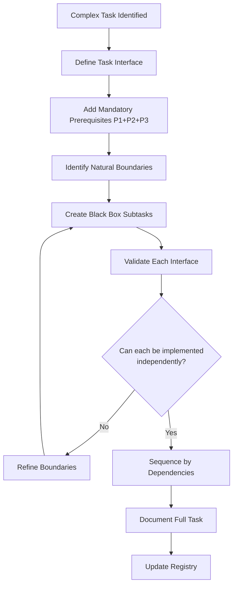

# Task Creation System - Black Box Architecture

## Core Philosophy

Tasks are the **primitive units of work** in our development system. Each task is a black box with clear inputs, outputs, and interfaces. Following Eskil Steenberg's principles:

> "A task should be understandable, replaceable, and maintainable by any developer who reads its interface, without needing to understand the entire system."

### Task Design Principles

1. **Black Box Boundaries**: Each task/subtask has clear input requirements and output specifications
2. **Single Responsibility**: One task = one clear objective that one person can own
3. **Replaceable Components**: Any subtask can be reimplemented using only its interface
4. **Human-First Design**: Optimize for developer understanding, not clever abstractions
5. **Interface Stability**: Task interfaces should remain stable even if implementation changes

## Task Complexity Assessment

Before creating any task, evaluate its complexity to determine if decomposition is needed:

```markdown
## TASK_COMPLEXITY_ASSESSMENT

Evaluate these factors:

1. **COMPONENTS** (How many distinct modules affected?)
   - LOW: 1-2 components (single black box)
   - MEDIUM: 3-4 components (multiple black boxes)
   - HIGH: 5+ components (system-wide change)

2. **INTERFACES** (How many APIs/contracts involved?)
   - LOW: Single interface
   - MEDIUM: 2-3 interfaces
   - HIGH: 4+ interfaces or interface changes

3. **DOMAINS** (How many expertise areas required?)
   - LOW: Single domain (e.g., just UI)
   - MEDIUM: 2 domains (e.g., UI + API)
   - HIGH: 3+ domains (e.g., UI + API + Database)

4. **COGNITIVE_LOAD** (Can one person hold this in their head?)
   - LOW: Single session task
   - MEDIUM: Multi-session but single context
   - HIGH: Requires context switching

DECOMPOSITION TRIGGER:
- ANY factor is HIGH
- TWO OR MORE factors are MEDIUM
- Task cannot be clearly defined in one paragraph

When triggered, ask user:
"This task involves [factors]. Following black box principles, I recommend decomposing it into smaller, independent subtasks created in a new and separate file. Should I proceed with decomposition?"
```

## Task Creation Protocol

### Step 1: Define Task Interface
Before creating any task, define its black box interface:

```markdown
## TASK_INTERFACE_DEFINITION

INPUTS (What this task needs to start):
- Required context: [list of prerequisite knowledge/files]
- Dependencies: [completed tasks or components]
- Resources: [tools, access, permissions needed]

OUTPUTS (What this task will produce):
- Deliverables: [specific files, components, or features]
- Side effects: [changes to existing components]
- Documentation: [what will be documented]

INVARIANTS (What must remain true):
- Constraints: [technical or business rules]
- Quality criteria: [performance, security, etc.]
- Compatibility: [what must not break]
```

### Step 2: Create Task File
Location: `memory_bank/tasks/task_XXX_description.md`

```markdown
# TASK_[ID]: [Descriptive Task Name]
timestamp: [ISO_DATE]
version: 1.0
status: Planning
owner: [developer name]
confidence: [HIGH|MEDIUM|LOW]

## Black Box Interface
### INPUT
- **Required Context**: 
  - [#COMPONENT_ID]: [why needed]
  - [document.md]: [what information needed]
- **Prerequisites**: 
  - [TASK_ID]: [what output needed from this task]
- **Parameters**:
  - [param_name]: [type] - [description]

### OUTPUT  
- **Deliverables**:
  - [#NEW_COMPONENT]: [description of what will be created]
  - [Modified #COMPONENT_ID]: [what changes will be made]
- **Artifacts**:
  - Tests: [what test coverage will be added]
  - Documentation: [what docs will be created/updated]
- **Decisions Generated**:
  - [Expected decision types that may emerge]

### INVARIANTS
- **Must Maintain**:
  - [System property that must not change]
  - [Compatibility requirement]
- **Quality Gates**:
  - Test coverage: [minimum %]
  - Performance: [criteria]
  - Security: [requirements]

## Task Definition
[One paragraph describing WHAT this task accomplishes, not HOW]

## Success Criteria
[Measurable criteria that define task completion]
1. [Specific, testable criterion]
2. [Another measurable outcome]
3. [Final validation criterion]

## Risk Assessment
| Risk | Level | Mitigation | Detection |
|------|-------|------------|-----------|
| [Risk description] | HIGH/MEDIUM/LOW | [How to prevent] | [How to detect early] |

## Implementation Strategy
[High-level approach without implementation details]

## Prerequisite Subtasks (MANDATORY)
> **NOTE:** These prerequisite subtasks are MANDATORY for every task. They must NOT be removed.
> See "Mandatory Prerequisite Subtasks" section for full templates.

### SUBTASK_[TASK_ID].P1: GitFlow Workflow
**Status**: ⏱️ Not Started
- Create feature branch from develop: `feature/task-[ID]-[description]`
- Use conventional commits: `<type>(<scope>): <subject>`
- Create PR targeting develop, merge after approval

### SUBTASK_[TASK_ID].P2: Tests Workflow
**Status**: ⏱️ Not Started
- Write tests BEFORE implementation (TDD)
- Use AAA pattern (Arrange, Act, Assert)
- All existing tests must pass (zero regressions)

### SUBTASK_[TASK_ID].P3: Task Finalization
**Status**: ⏱️ Not Started
- Run `flutter analyze` (0 issues), `dart run custom_lint` (0 issues), `flutter test --coverage`
- Run `sonar-scanner` locally — Quality Gate must be PASS (project has zero CI; local scan is the only gate)
- Flutter Inspector MCP smoke (if app running on device): app errors, runtime errors, screenshots
- Git finalize with conventional commit + Co-Authored-By trailer
- Compose PR description with SonarCloud block (timestamp, commit, branch, PASS/FAIL, coverage, dart:S3776 = 0)
- Display on-screen execution summary (no document)

## Subtasks
[Only created if complexity assessment triggers decomposition]
```

### Step 3: Register Task
Add to `memory_bank/tasks/task_registry.md`:

```markdown
# Task Registry
timestamp: [ISO_DATE]
version: [X.Y]

## Active Tasks

### TASK_XXX: [Task Name]
- **Status**: Planning|Active|Blocked|Complete
- **Interface**: INPUT[components, prerequisites] → OUTPUT[deliverables]  
- **Owner**: [name]
- **Confidence**: [HIGH|MEDIUM|LOW]
- **Black Box**: [One line describing what this black box does]
- **Created**: [date]
- **Modified**: [date]
- **Subtasks**: [count] (if decomposed)
- **Prerequisites**: ✅ GitFlow (P1) + Tests (P2) + Finalization (P3) included

## Task Creation Log
[DATE] TASK_XXX created by [name] - [reason/trigger]

## Task ID Sequence
Last Used: TASK_XXX
Next Available: TASK_XXX
```

## Task Decomposition Framework

When complexity assessment triggers decomposition:

### Decomposition Principles

```markdown
## BLACK_BOX_DECOMPOSITION

1. **Interface Isolation**: Each subtask is a complete black box
   - Has its own INPUT/OUTPUT specification
   - Can be tested independently
   - Can be assigned to different developers

2. **Dependency Chain**: Subtasks form a clear pipeline
   - Output of subtask N can be input to subtask N+1
   - No circular dependencies
   - Clear data flow between black boxes

3. **Single Responsibility**: One subtask = one outcome
   - If you need "AND" in the description, split it
   - Each subtask should fit in working memory
   - One person should be able to complete it

4. **Replaceability Test**: 
   Ask: "Could someone else implement this subtask using only its interface?"
   If NO → refine the interface specification
```

### Subtask Template

Within the main task file:

```markdown
## Subtasks

### SUBTASK_[TASK_ID].[SEQ]: [Descriptive Name]
**Status**: ⏱️ Not Started | 🔄 In Progress | ✅ Complete | ❌ Blocked

#### Black Box Interface
**INPUT**:
- From previous subtask: [specific output needed]
- From context: [required files/components with #IDs]
- Parameters: [any configuration needed]

**OUTPUT**:
- Produces: [specific deliverable]
- Modifies: [what gets changed]
- For next subtask: [what gets passed forward]

**INVARIANTS**:
- Must preserve: [what cannot break]
- Must validate: [what to check]

#### Definition
[One paragraph: WHAT this subtask accomplishes]

#### Acceptance Criteria
- [ ] [Specific, measurable criterion]
- [ ] [Test that must pass]
- [ ] [Output that must exist]

#### Estimated Effort
[Time estimate] | Complexity: [Low|Medium|High]

#### Dependencies
- Depends on: [SUBTASK_ID or "none"]
- Blocks: [SUBTASK_ID or "none"]

---
[Repeat for each subtask]
```

### Decomposition Workflow



## Mandatory Prerequisite Subtasks

Every task, regardless of complexity, **MUST** include these three prerequisite subtasks. They enforce the project's GitFlow branching model, TDD testing strategy, and task finalization ceremony. Prerequisite subtasks use the `P` prefix (e.g., `.P1`, `.P2`, `.P3`) to distinguish them from domain-specific subtasks (`.1`, `.2`, etc.).

> **For tasks created before this update:** Prerequisite compliance should be verified during execution but retroactive file updates are not required.

### SUBTASK_XXX.P1: GitFlow Workflow

#### Black Box Interface
**INPUT**:
- Task definition and scope
- GITFLOW.md reference document
- Current `develop` branch (latest)

**OUTPUT**:
- Feature branch: `feature/task-XXX-description` created from develop
- All commits using conventional format: `<type>(<scope>): <subject>`
- Pull Request created targeting `develop` branch
- Branch merged and deleted after approval

**INVARIANTS**:
- Branch naming MUST follow: `feature/task-XXX-description`
- Commit format MUST follow: `<type>(<scope>): <subject>`
  - Types: feat, fix, docs, style, refactor, perf, test, chore
  - Scope: optional area affected (e.g., auth, api, provider)
- PR MUST target `develop` branch (never commit directly to develop or master)
- Source branch MUST be deleted after merge

#### Definition
Establish proper GitFlow branching for the task by creating a feature branch from develop, ensuring all work uses conventional commits, and completing with a reviewed PR back to develop.

#### Acceptance Criteria
- [ ] Feature branch created from latest `develop`: `feature/task-XXX-description`
- [ ] All commits follow conventional format: `<type>(<scope>): <subject>`
- [ ] PR created with description, related task reference, and testing notes
- [ ] PR reviewed and approved before merge
- [ ] Source branch deleted after merge
- [ ] No direct commits to `develop` or `master`

#### Estimated Effort
Ongoing (throughout task lifecycle) | Complexity: Low

---

### SUBTASK_XXX.P2: Tests Workflow

#### Black Box Interface
**INPUT**:
- Task requirements and acceptance criteria
- Existing test infrastructure: `flutter_test` (unit + widget), `bloc_test` (Bloc state transitions), `mocktail` (mocks), `integration_test` (E2E on device)
- Test utilities under `test/helpers/` (when present) and per-feature factories under `test/features/<x>/_factories/`
- Test setup is **per-test, isolated** — no global setup file. `GetIt.I.reset()` between tests when DI is touched

**OUTPUT**:
- Tests written BEFORE implementation code (TDD: Red-Green-Refactor)
- All new code covered by appropriate test types (unit / widget / Bloc / integration)
- All existing tests passing (zero regressions)
- Coverage baseline maintained or improved (`coverage/lcov.info` produced for SonarCloud consumption in P3)

**INVARIANTS**:
- TDD cycle MUST be followed: Write failing test → Implement → Refactor
- AAA pattern (Arrange, Act, Assert) MUST be used in all tests
- Per-feature test factories MUST be used where applicable
- Zero test regressions allowed — all existing tests must continue to pass
- Cognitive Complexity ceiling enforced (`dart:S3776` ≤ 15 per method, DEC_025) — 0 violations on new code

#### Definition
Enforce Test-Driven Development for the task by writing tests before implementation, using proper Flutter/Dart test patterns and existing test infrastructure, and ensuring zero regressions across the entire test suite.

#### Acceptance Criteria
- [ ] Unit tests written BEFORE implementation code (TDD)
- [ ] AAA pattern (Arrange, Act, Assert) used in all test cases
- [ ] `bloc_test` used for Bloc state transitions where applicable
- [ ] Widget tests added for new design-system widgets / pages
- [ ] Integration tests added for new device-only flows (if applicable)
- [ ] All existing tests continue to pass (zero regressions)
- [ ] Coverage does not decrease from current baseline (verified by SonarCloud in P3)
- [ ] No method on touched files exceeds Cognitive Complexity 15 (`dart:S3776`)

#### Test Commands Reference
```bash
# Static analysis (must be 0 issues before staging)
flutter analyze
dart run custom_lint                 # Architecture lint rules (when registered)

# Unit + widget + Bloc tests
flutter test                          # Full suite
flutter test test/<feature>/          # Targeted run during TDD loop
flutter test --coverage               # Produces coverage/lcov.info (consumed by sonar-scanner in P3)

# Integration tests (require device)
flutter test integration_test/        # Device-only flows
```

#### Estimated Effort
Ongoing (throughout task lifecycle) | Complexity: Medium

---

### SUBTASK_XXX.P3: Task Finalization

#### Black Box Interface
**INPUT**:
- Completed implementation from all domain subtasks
- All code changes staged/committed on feature branch
- `coverage/lcov.info` produced by `flutter test --coverage` (P2 output)
- `sonar-project.properties` at repo root + `SONAR_TOKEN` env var (USER token, not project token)
- `sonar-scanner` CLI installed locally (`brew install sonar-scanner` if missing)
- Running application on a connected device for Flutter Inspector MCP verification (optional but preferred)

**OUTPUT**:
- `flutter analyze` = 0 issues
- `dart run custom_lint` = 0 issues (when architecture lint rules are registered)
- `flutter test` suite passing; coverage non-decreasing
- **Local SonarCloud scan executed; Quality Gate = PASS; `dart:S3776` violations on new code = 0**
- Flutter Inspector MCP smoke captured (or explicitly skipped with reason)
- Git finalized: conventional commit(s) on feature branch + `Co-Authored-By` trailer
- **PR description includes the SonarCloud Quality Gate block** (timestamp, commit SHA, branch, PASS/FAIL, coverage, dart:S3776 = 0)
- On-screen execution summary displayed (NO document generated)

**INVARIANTS**:
- All existing tests MUST pass (zero regressions)
- `flutter analyze` MUST return 0 issues
- **SonarCloud Quality Gate MUST be PASS on the PR head commit** — this repo has zero CI; local `sonar-scanner` is the only enforcement path (per `CLAUDE.md` §Local Sonar Mandate + memory `local_sonar_policy.md`). MCP `analyze_file_list` does NOT substitute for the full project scan
- `dart:S3776` Cognitive Complexity > 15 on new code is a BLOCK condition — fix before opening PR (DEC_025)
- Conventional commit format enforced: `<type>(<scope>): <subject>` + `Co-Authored-By` trailer
- Summary is screen-only — NEVER generate a summary document/file

#### Definition
Execute the end-of-task ceremony: run static analysis + custom lint + full test suite + local SonarCloud scan; validate via Flutter Inspector MCP (if app is running on device); finalize Git with conventional commits; compose the PR description with the mandatory SonarCloud block; display a structured execution summary on screen.

#### Execution Steps

**Step 1: Static Analysis + Tests + Coverage**
```bash
flutter analyze                      # 1a. Static analysis (must be 0)
dart run custom_lint                 # 1b. Architecture lint rules (when registered; must be 0)
flutter test                         # 1c. Full unit + widget + Bloc + convention test suite
flutter test --coverage              # 1d. Produces coverage/lcov.info (consumed in 1f)
```
Capture: total tests, passed, failed, duration; coverage delta vs `develop`.

**Step 1f: Local SonarCloud Scan (MANDATORY — zero CI; this is the only Quality Gate)**
```bash
sonar-scanner \
  -Dsonar.token="$SONAR_TOKEN" \
  -Dsonar.branch.name="$(git rev-parse --abbrev-ref HEAD)"
```
Capture from SonarCloud UI (or scanner log): Quality Gate status, new-code coverage %, new-code issue counts (Blocker/Critical/Major), `dart:S3776` Cognitive Complexity violations on new code.
**Block condition**: if Quality Gate = FAIL or `dart:S3776` > 0 on new code, do NOT open the PR. Fix, commit, re-run scan on the new commit.

**Step 2: Flutter Inspector MCP Smoke (if app is running on device)**
- `mcp__dart__list_running_apps` — identify the active Flutter Dart VM session
- `mcp__dart__get_app_logs` — capture any error/warning output since launch
- `mcp__dart__get_runtime_errors` — assert empty
- `mcp__flutter-inspector__get_app_errors` — assert empty
- `mcp__flutter-inspector__get_screenshots` — capture final state of affected screens
- **Skip condition:** if no device connected / app not running, skip and note in summary

**Step 3: Git Finalization + PR Composition**
- Stage only task-related files (never stage `repomix-output.xml`, `.scannerwork/`, screenshots, secrets, or unrelated diffs)
- Commit with conventional format and `Co-Authored-By: Claude Opus 4.7 (1M context) <noreply@anthropic.com>` trailer
- Verify with `git log -1 --oneline && git status`
- Re-run **Step 1f** on the final commit so SonarCloud reflects the PR head exactly
- Compose PR description including:
  - Task summary (1–3 bullets)
  - Test plan (markdown checklist)
  - **MANDATORY SonarCloud block** (template below)

**SonarCloud block (paste verbatim, fill values):**
```
## SonarCloud (local sonar-scanner — repo has zero CI)
- Scan run: <UTC timestamp>
- Commit scanned: <SHA>
- Branch: <branch>
- Quality Gate: PASS
- New-code coverage: X.X%
- New-code issues: N (Blocker: a, Critical: b, Major: c)
- dart:S3776 (Cognitive Complexity) on new code: 0
```

**Step 4: Display On-Screen Summary**
```
═══════════════════════════════════════════════════════════
                    TASK EXECUTION SUMMARY
═══════════════════════════════════════════════════════════

## Changes Made
- Files modified: [list]
- Lines added/removed: [counts]
- DEC entries: [list]

## Test Results
┌─────────────────────────┬────────┬────────┬──────────┐
│ Suite                   │ Total  │ Status │ Duration │
├─────────────────────────┼────────┼────────┼──────────┤
│ flutter analyze         │  —     │ ✅/❌  │ X.Xs     │
│ custom_lint             │  —     │ ✅/❌  │ X.Xs     │
│ flutter test            │ XXXX   │ ✅/❌  │ XX.Xs    │
│ Coverage delta          │ +X.X%  │ ✅/❌  │ —        │
└─────────────────────────┴────────┴────────┴──────────┘

## SonarCloud (local sonar-scanner — DEC: zero-CI repo)
- Scan run: <UTC timestamp>
- Commit scanned: <SHA>
- Branch: <branch>
- Quality Gate: PASS | FAIL
- New-code coverage: X.X%
- New-code issues: N (Blocker: a, Critical: b, Major: c)
- dart:S3776 violations on new code: 0 (REQUIRED — DEC_025)

## Flutter Inspector MCP
- App errors: 0 (or "skipped — app not running")
- Runtime errors: 0 (or "skipped")
- Screenshots captured: [routes]

## Git
- Branch: [current branch]
- Commit: [short hash] <type>(<scope>): <subject>
- Status: clean working tree
═══════════════════════════════════════════════════════════
```

#### Acceptance Criteria
- [ ] `flutter analyze` returns 0 issues
- [ ] `dart run custom_lint` returns 0 issues (when registered)
- [ ] `flutter test` passes; zero regressions; coverage non-decreasing
- [ ] `flutter test --coverage` produces `coverage/lcov.info`
- [ ] **`sonar-scanner` runs locally on the PR head commit; SonarCloud Quality Gate = PASS**
- [ ] **`dart:S3776` Cognitive Complexity violations on new code = 0** (DEC_025)
- [ ] **PR description includes the SonarCloud block** (timestamp, commit, branch, PASS/FAIL, coverage, dart:S3776 = 0)
- [ ] Flutter Inspector MCP smoke completed (or explicitly skipped with reason)
- [ ] Git commit(s) created with conventional format and `Co-Authored-By` trailer
- [ ] On-screen summary displayed (no document file created)

#### Estimated Effort
45–60 minutes | Complexity: Low (sonar-scanner full-project scan adds ~5–10 min vs prior 30-min estimate)

---

## Task Quality Checklist

Before finalizing any task creation:

```markdown
## TASK_QUALITY_VALIDATION

### Interface Quality
- [ ] Inputs are clearly specified with types
- [ ] Outputs are measurable and testable
- [ ] Invariants protect system integrity
- [ ] No implementation details in interface

### Black Box Principles
- [ ] Task can be understood without reading other tasks
- [ ] Could be reimplemented from scratch using interface
- [ ] Single, clear responsibility
- [ ] No hidden dependencies

### Decomposition Quality (if applicable)
- [ ] Each subtask is independently testable
- [ ] Subtask boundaries follow natural module boundaries
- [ ] No subtask requires understanding another's internals
- [ ] Data flow between subtasks is explicit

### Documentation Quality
- [ ] One paragraph clearly explains WHAT not HOW
- [ ] Success criteria are measurable
- [ ] Risks are identified with mitigations
- [ ] Confidence level is assessed

### Mandatory Prerequisites
- [ ] SUBTASK_XXX.P1 (GitFlow) present and complete
- [ ] Feature branch follows naming: `feature/task-XXX-description`
- [ ] All commits use conventional format: `<type>(<scope>): <subject>` + `Co-Authored-By` trailer
- [ ] PR created targeting `develop` branch
- [ ] SUBTASK_XXX.P2 (Tests) present and complete
- [ ] Tests written BEFORE implementation (TDD)
- [ ] AAA pattern used in all test cases
- [ ] All existing tests pass (zero regressions)
- [ ] No method on touched files exceeds Cognitive Complexity 15 (`dart:S3776`)
- [ ] SUBTASK_XXX.P3 (Finalization) present and complete
- [ ] `flutter analyze` = 0; `dart run custom_lint` = 0; `flutter test` passes
- [ ] **Local `sonar-scanner` ran on PR head commit; Quality Gate = PASS** (this repo has zero CI — local scan is the only Quality Gate)
- [ ] **PR description carries the SonarCloud block** (timestamp, commit, branch, PASS/FAIL, coverage, dart:S3776 = 0)
- [ ] Flutter Inspector MCP verified (or skipped with reason)
- [ ] On-screen summary displayed (no document)

### Maintainability
- [ ] Another developer could take over this task
- [ ] Interface will remain stable if implementation changes
- [ ] Task aligns with system patterns
```

## Task Metadata Standards

### Task IDs
```
TASK_[THREE_DIGIT_SEQUENCE]
Examples: TASK_001, TASK_002, TASK_100

Subtask IDs:
SUBTASK_[TASK_ID].[SEQUENCE]
Examples: SUBTASK_001.1, SUBTASK_001.2
```

### Status Values
```
Planning     - Interface being defined
Active       - Work in progress  
Blocked      - Waiting on external factor
Complete     - All criteria met
Archived     - Moved to tasks/archive/
```

### Confidence Levels
```
HIGH (>85%)    - Clear requirements, known solution
MEDIUM (60-85%) - Some unknowns but path is clear
LOW (<60%)     - Significant unknowns, exploratory
```

### Priority Markers
```
^critical     - Blocks other work
^high        - Core functionality
^medium      - Important but not blocking
^low         - Nice to have
```

## Task Creation Examples

### Example 1: Simple Task (No Decomposition)
```markdown
# TASK_001: Add User Email Validation
timestamp: 2025-01-15T10:00:00Z
status: Planning
confidence: HIGH

## Black Box Interface
### INPUT
- Required Context: #MODEL_USER, #UTIL_VALIDATE
- Prerequisites: none
- Parameters: email_string: string

### OUTPUT
- Deliverables: Enhanced #UTIL_VALIDATE with email validation
- Artifacts: 
  - Tests: Unit tests for email validation
  - Documentation: Updated validation rules

### INVARIANTS
- Must Maintain: Existing validation methods continue working
- Quality Gates: 100% test coverage for email validation

## Task Definition
Add RFC-compliant email validation to the validation utility module, ensuring proper handling of edge cases and clear error messages.

## Success Criteria
1. Email validation follows RFC 5322 standard
2. Clear error messages for different failure types
3. All existing validation methods still pass tests

## Prerequisite Subtasks (MANDATORY)

### SUBTASK_001.P1: GitFlow Workflow
**Status**: ⏱️ Not Started
- Branch: `feature/task-001-email-validation`
- Commits: `feat(validation): ...`, `test(validation): ...`
- PR targeting develop

### SUBTASK_001.P2: Tests Workflow
**Status**: ⏱️ Not Started
- Unit tests for email validation (TDD)
- AAA pattern, 100% coverage for new code
- Zero regressions on existing validation tests

### SUBTASK_001.P3: Task Finalization
**Status**: ⏱️ Not Started
- Run flutter analyze + custom_lint + flutter test --coverage; run local sonar-scanner (Quality Gate must PASS, dart:S3776=0); Flutter Inspector MCP smoke; git finalize; PR description with SonarCloud block; display summary
```

### Example 2: Complex Task (With Decomposition)
```markdown
# TASK_002: Implement Authentication System
timestamp: 2025-01-15T10:00:00Z
status: Planning
confidence: MEDIUM

## Black Box Interface
### INPUT
- Required Context: System architecture, Security requirements
- Prerequisites: TASK_001 (validation utilities)
- Parameters: Authentication strategy configuration

### OUTPUT
- Deliverables: 
  - #SVC_AUTH: Authentication service
  - #UI_LOGIN: Login interface
  - #MODEL_SESSION: Session model
- Artifacts:
  - Tests: Integration tests for auth flow
  - Documentation: Auth flow diagrams

### INVARIANTS
- Must Maintain: System security standards
- Quality Gates: 
  - No plain text passwords
  - Session timeout implementation
  - CSRF protection

## Task Definition
Create a complete authentication system with login UI, backend service, and session management following security best practices.

## Prerequisite Subtasks (MANDATORY)

### SUBTASK_002.P1: GitFlow Workflow
**Status**: ⏱️ Not Started
- Branch: `feature/task-002-auth-system`
- Commits: `feat(auth): ...`, `test(auth): ...`
- PR targeting develop

### SUBTASK_002.P2: Tests Workflow
**Status**: ⏱️ Not Started
- Unit tests for auth service (TDD)
- Integration tests for auth endpoints
- E2E tests for login/logout flow
- AAA pattern, zero regressions

### SUBTASK_002.P3: Task Finalization
**Status**: ⏱️ Not Started
- Run flutter analyze + custom_lint + flutter test --coverage; run local sonar-scanner (Quality Gate must PASS, dart:S3776=0); Flutter Inspector MCP smoke; git finalize; PR description with SonarCloud block; display summary

## Subtasks (created in a separate file)

### SUBTASK_002.1: Create Authentication Service Interface
**Status**: ⏱️ Not Started

#### Black Box Interface
**INPUT**:
- Security requirements document
- #MODEL_USER schema

**OUTPUT**:
- #SVC_AUTH interface definition
- Method signatures for auth operations

**INVARIANTS**:
- Must support multiple auth strategies
- Must not expose implementation details

#### Definition
Define the authentication service interface with methods for login, logout, session validation, and password management.

#### Acceptance Criteria
- [ ] Interface documented with TypeScript/JSDoc
- [ ] All methods have clear input/output types
- [ ] Error cases are specified

### SUBTASK_002.2: Implement Authentication Logic
**Status**: ⏱️ Not Started

#### Black Box Interface
**INPUT**:
- #SVC_AUTH interface from SUBTASK_002.1
- Crypto libraries for hashing

**OUTPUT**:
- Working authentication service implementation
- Unit tests for all methods

[Continue with remaining subtasks...]
```

## Integration with Memory Bank

### File Organization
```
memory_bank/
├── tasks/
│   ├── task_registry.md         # Central registry
│   ├── task_001_validation.md   # Individual task files
│   ├── task_002_auth.md        
│   └── archive/                 # Completed tasks
│       └── task_000_setup.md
```

### Cross-References
- Tasks reference components: `#COMPONENT_ID`
- Tasks generate decisions: `#DEC_XXX`  
- Components reference tasks: `@tasks[TASK_XXX]`
- Decisions reference source: `Source: TASK_XXX`

### Update Protocol
When creating a task:
1. Create task file with interface definition
2. Update task_registry.md
3. If decomposed, create all subtask interfaces
4. Add task reference to affected components in codeMap_root.md
5. Update activeContext.md if task is current focus

## Best Practices

### DO:
- ✅ Define interfaces before implementation
- ✅ Keep subtasks independently testable
- ✅ Use clear, descriptive names
- ✅ Document WHY, not just WHAT
- ✅ Assess complexity before creating
- ✅ Make dependencies explicit
- ✅ Keep one person's cognitive load in mind
- ✅ Include mandatory prerequisite subtasks (P1: GitFlow, P2: Tests, P3: Finalization)
- ✅ Create feature branch from develop before starting implementation
- ✅ Write tests before implementation code (TDD)
- ✅ Run `flutter analyze`, `dart run custom_lint`, full test suite, and **local `sonar-scanner`** before opening PR
- ✅ Paste the SonarCloud Quality Gate block into every PR description
- ✅ Display on-screen summary at task close

### DON'T:
- ❌ Mix interface with implementation
- ❌ Create circular dependencies
- ❌ Hide critical information in subtasks
- ❌ Make subtasks too granular
- ❌ Forget to update registry
- ❌ Skip confidence assessment
- ❌ Create tasks without clear outputs
- ❌ Skip prerequisite subtasks (P1/P2/P3)
- ❌ Commit directly to develop or master
- ❌ Write implementation before tests
- ❌ Generate summary documents (display on screen only)
- ❌ Open a PR without a passing local `sonar-scanner` Quality Gate (this repo has zero CI — there is no second chance)
- ❌ Substitute MCP `analyze_file_list` for the full project `sonar-scanner` scan (per-file analysis does NOT report Quality Gate status)
- ❌ Land code with `dart:S3776` Cognitive Complexity > 15 on new methods (DEC_025 hard ceiling)

## Quick Reference Card
```markdown
Task Creation Flow:
1. Assess Complexity → 2. Define Interface → 3. Create File (with P1+P2+P3) → 4. Register → 5. Decompose if needed

Mandatory Prerequisites: P1 (GitFlow) + P2 (Tests) + P3 (Finalization) — always included
Prerequisite IDs: SUBTASK_XXX.P1, SUBTASK_XXX.P2, SUBTASK_XXX.P3

Status: ⏱️ Not Started | 🔄 In Progress | ✅ Complete | ❌ Blocked
Confidence: HIGH >85% | MEDIUM 60-85% | LOW <60%
Priority: ^critical | ^high | ^medium | ^low

Black Box Test: Can someone else implement this using only the interface?
Single Responsibility Test: Does this do ONE thing well?
Replaceability Test: Could this be rewritten without breaking the system?

P3 Finalization Gate (zero-CI repo — local sonar-scanner is THE gate):
  flutter analyze            → 0 issues
  dart run custom_lint       → 0 issues
  flutter test --coverage    → green; coverage non-decreasing
  sonar-scanner              → Quality Gate PASS; dart:S3776 on new code = 0
  PR description             → MUST include SonarCloud block (timestamp/SHA/branch/PASS/coverage/S3776=0)
```